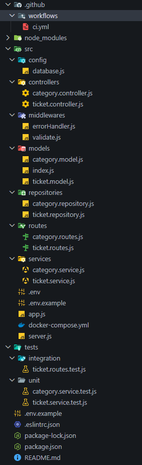

<div align="center">
# TicketFlow API

A REST API for managing customer support tickets — creation, tracking, status transitions, categorization, and prioritization. Built with a layered architecture (Router → Controller → Service → Repository → Database) and validated by a CI pipeline on every push/PR.


## Tech Stack

- **Runtime:** Node.js (ESM — `"type": "module"`)
- **Framework:** Express
- **Database:** PostgreSQL
- **ORM:** Sequelize
- **Validation:** Zod
- **Testing:** Jest (unit) + Supertest (integration)
- **CI:** GitHub Actions
- **Local DB:** Docker Compose

## Architecture

```
Client → Router → Controller → Service → Repository → PostgreSQL
                                   ↑
                        Unit tests mock the Repository
```

- **Router** — maps HTTP verb + URL to a controller. No logic.
- **Controller** — reads the request, calls the service, shapes the HTTP response.
- **Service** — business rules (e.g. ticket status transitions). No knowledge of HTTP or SQL.
- **Repository** — the only layer that talks to the database, via Sequelize models.

## Getting Started

### 1. Clone and install dependencies
```bash
npm install
```

### 2. Configure environment variables
```bash
cp .env.example .env
```
Edit `.env` with your own values if needed. Defaults match `docker-compose.yml`.

### 3. Start PostgreSQL (via Docker)
```bash
docker compose up -d
```

### 4. Run the server
```bash
npm run dev
```
The API will be available at `http://localhost:3000`. Sequelize will connect and (once models exist) sync the schema automatically.

### 5. Verify it's running
```bash
curl http://localhost:3000/health
```
Expected response: `{"status":"ok"}`

## Environment Variables

| Variable      | Description                  | Default       |
|---------------|-------------------------------|----------------|
| `PORT`        | Port the API listens on       | `3000`         |
| `DB_HOST`     | PostgreSQL host                | `localhost`    |
| `DB_PORT`     | PostgreSQL port                | `5432`         |
| `DB_USER`     | PostgreSQL username            | `postgres`     |
| `DB_PASSWORD` | PostgreSQL password            | `postgres`     |
| `DB_NAME`     | Database name                  | `ticketflow`   |

## Data Model

```
CATEGORY ||--o{ TICKET : contains

CATEGORY
  id            int (PK)
  name          string

TICKET
  id            int (PK)
  title         string
  description   string
  status        enum(open, in_progress, resolved, closed)
  priority      enum(low, medium, high)
  category_id   int (FK)
  created_at    datetime
  updated_at    datetime
```

## Business Rules

- A ticket is created with status `open` by default.
- Allowed transitions: `open → in_progress → resolved → closed`.
- A `closed` ticket can only become active again via an explicit reopening (`closed → open`).
- Direct transitions from `open` to `closed` are not allowed — must pass through `in_progress` and `resolved`.
- `priority` must be one of `low`, `medium`, `high`.

## Scripts

| Command         | Description                          |
|-----------------|----------------------------------------|
| `npm start`     | Start the server                       |
| `npm run dev`   | Start the server with auto-reload      |
| `npm test`      | Run unit tests                         |

## Project Structure

```

```

## CI Pipeline

Every push and pull request triggers a GitHub Actions workflow that:
1. Installs dependencies
2. Runs lint
3. Runs unit tests

A pull request cannot be merged unless both lint and tests pass.
